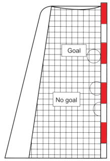

# Der Punktgewinn, die Spielentscheidung

## Punktgewinn

### 9:1
Ein Tor ist erzielt, wenn der Ball die Torlinie vollständig überquert hat ([Abbildung Nr. 3](#abbildung-3)), sofern vor dem oder beim Wurf der Werfer oder seine
Mitspieler sich nicht regelwidrig verhalten haben.

Gelangt der Ball ins Tor, obwohl ein Spieler der abwehrenden
Mannschaft eine Regelwidrigkeit begangen hat, ist auf Tor zu
erkennen.

Hat ein Schiedsrichter oder der Zeitnehmer das Spiel unterbrochen,
bevor der Ball die Torlinie vollständig überquert hat, darf nicht auf Tor
entschieden werden.

Spielt ein Spieler den Ball in das eigene Tor, führt dies zum
Torgewinn für die gegnerische Mannschaft, ausgenommen, der
Torwart führt einen Abwurf aus und der Ball überquert die
Torraumlinie nicht (Regeln [12:2](#12:2), Absatz 2). Ein von einem beliebigen
Spieler erzieltes Eigentor wird als „1-Punkt“-Tor gewertet.

***Kommentar:***

Wird dem Ball der Weg ins Tor durch eine nicht am Spiel beteiligte Sache
oder Person (Zuschauer etc.) erfolgreich verwehrt, muss auf Tor
entschieden werden, wenn die Schiedsrichter der Überzeugung sind, dass
der Ball ansonsten ins Tor gelangt wäre.

### 9:2
Kreative oder spektakuläre Torsituationen werden mit zwei Punkten
gewertet (siehe [Erläuterung No.1](#1.-wertung-der-punkte)).

### 9:3
Der Torerfolg bei einem 6-Meter-Wurf wird mit zwei Punkten gewertet.

### 9:4 
Nach jedem erzielten Tor wird das Spiel mit Abwurf durch den Torwart
aus seinem Torraum fortgesetzt (Regel [12:1](#12:1)).

### 9:5 
Wenn durch den Schiedsrichter auf Tor entschieden und der Abwurf
ausgeführt wurde, kann das Tor nicht mehr annulliert werden.

Ertönt direkt nach einem Torerfolg und vor der Abwurfausführung das
Schlusssignal (Spielabschnitt oder Spielende), so müssen die
Schiedsrichter (ohne Abwurf) deutlich anzeigen, dass sie auf Tor
entschieden haben.

## Punktgewinn durch den Torwart

### 9:6 
Erzielt ein Torwart ein Tor, wird dieses mit zwei Punkten gewertet.

## Spielentscheidung

### 9:7 
Ist der Spielstand am Ende des Spielabschnittes unentschieden, wird
das Prinzip des „Golden Goal“ angewendet (Regel [2:6](#2:6)). Sieger ist die
Mannschaft, welche als erste ein Tor erzielt.

### 9:8 
Haben beide Mannschaften je einen Spielabschnitt gewonnen, kommt
es zum „Shootout“.

Fünf spielberechtigte Spieler führen abwechselnd mit den Spielern
der gegnerischen Mannschaft die Würfe aus. Ist ein Torwart einer der
Werfer, ist er in dieser Situation als Feldspieler zu betrachten (Regel [4:8](#4:8) Kommentar).

Sieger ist, wer nach fünf Würfen mehr Punkte erzielt hat.

Ist nach dem ersten Durchgang keine Entscheidung gefallen, wird das
„Shootout“ fortgeführt. Hierzu werden zuerst die Seiten gewechselt
(ohne Wechsel des Auswechselraums – siehe Kommentar). Wieder
führen fünf spielberechtigte Spieler abwechselnd mit den Spielern der
gegnerischen Mannschaft die Würfe aus. Nun beginnt die andere
Mannschaft.

Das Spiel ist bei diesem oder bei weiteren Durchgängen entschieden,
sobald eine Mannschaft bei gleicher Anzahl von Wurfversuchen die Führung übernimmt.

***Kommentar:***
**Spielentscheidung durch das „Shootout“:**

Vor dem „Shootout“ losen die Schiedsrichter die Seitenwahl und die
beginnende Mannschaft aus (siehe jedoch [Erläuterung No. 2](#2.-besondere-umstände)).

Hat sich die Mannschaft, die beim Losen gewonnen hat, entschieden, das
„Shootout“ zu beginnen, hat die andere Mannschaft das Recht, die Seite zu
wählen. Wählt hingegen die Mannschaft, die beim Losen gewonnen hat, die
Seite, beginnt die andere Mannschaft mit dem „Shootout“.

Beide Torhüter stehen zunächst mindestens mit einem Fuß auf ihrer
Torlinie. Der Feldspieler muss zu Beginn der Aktion im Spielfeld, mit einem
Fuß auf dem linken oder rechten Kreuzungspunkt der Torraumlinie und der
Seitenlinie stehen. Nach Anpfiff des Schiedsrichters spielt er den Ball zu
seinem sich auf der Torlinie befindenden Torwart. Der Ball darf bei diesem
Zuspiel den Sand nicht berühren. Sobald der Ball die Hand des Werfers
verlassen hat, dürfen sich beide Torhüter vorwärts bewegen. Der
wurfausführende Torwart darf seinen Torraum nicht verlassen.

Er muss den Ball innerhalb von 3 Sekunden entweder direkt auf das
gegnerische Tor werfen oder dem inzwischen Richtung gegnerischem Tor
laufenden Mitspieler zuspielen, ohne dass der Ball den Sand berühren darf.

Der Spieler muss den Ball annehmen und versuchen, regelgerecht ein Tor
zu erzielen.

Begehen der ausführende Torwart oder der angreifende Spieler eine
Regelwidrigkeit, ist in diesem Moment die Aktion beendet.

Hat der verteidigende Torwart seinen Torraum verlassen, darf er jederzeit
wieder dorthin zurückkehren.

Sinkt die Spielerzahl in einem Durchgang unter fünf, kann kein Spieler
zweimal werfen. Diese Mannschaft hat dann entsprechend weniger Wurfmöglichkeiten.

### 9:9 
Vereitelt der verteidigende Torwart beim „Shootout“ durch eine
Regelwidrigkeit ein Tor, ist auf 6-Meter-Wurf zu entscheiden (siehe [Erläuterung No. 9](#9.-shootout-und-schneller-gegenstoß)).

***Kommentar:***
Jeder spielberechtigte Spieler darf diesen 6-Meter-Wurf ausführen.

### 9:10 
Während des „Shootout“ halten sich alle beteiligten Feldspieler in
ihrem Auswechselraum auf. Nach ihrem Versuch gehen sie in ihren
Auswechselraum zurück.

### Abbildung 3
Der Torgewinn

