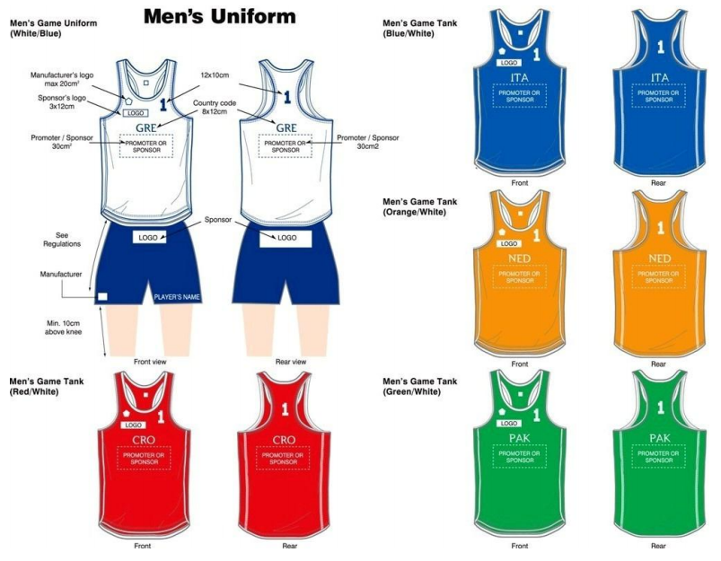

# Bestimmungen zur Spielkleidung

Spielkleidung und Accessoires tragen gleichermaßen zur
Leistungssteigerung der Athleten wie zur Wahrung des sportlichen und
attraktiven Images des Sports bei.

Dieser Abschnitt der Spielregeln liefert alle Details in Hinblick auf Farbe,
Stil, Menge, Stoff und Marken von Spielkleidung und Accessoires, die von
allen Mannschaften und Organisatoren verwendet werden müssen.

Während der Technischen Sitzung und während des Wettkampfes muss
die Wettkampfleitung (WL) die Spielkleidung aller teilnehmenden
Mannschaften prüfen. Die Spielkleidung aller Männer- und
Frauenmannschaften muss die nachfolgenden Bestimmungen erfüllen.
Gemäß der Olympischen Charta sind religiös, politisch oder rassistisch
motivierte Botschaften auf der Spielkleidung strengstens untersagt. 

### Tank-Tops der Männer / Tops der Frauen 
Die Tank-Tops und Tops müssen den Abbildungen entsprechen. Die TankTops der Männer müssen ärmellos und eng geschnitten sein, unter
Berücksichtigung der vorgesehenen Werbeflächen. Die Tops der Frauen
(bauchfrei) müssen ebenfalls eng geschnitten sein, mit einem weit nach
innen laufenden Armloch auf dem Rücken unter Berücksichtigung der
vorgesehenen Werbeflächen. Das Tragen von T-Shirts unter den TankTops für die Mannschaftsoffiziellen ist nicht erlaubt. 

#### Farbe
Die Tank-Tops/Tops sind in hellen Farben (rot, blau, gelb, grün,
orange und weiß) zu halten; damit sind am Strand übliche Farben
gewählt. 

#### Werbung
- Logos der Promoter und Sponsoren:

   Die Logos der Promoter und Sponsoren können auf der Vorder- und
Rückseite der Tank-Tops der Männer und der Tops der Frauen
platziert werden. 
- Herstellerlogos:

   Das Logo des Herstellers wird auf der Vorderseite der Tank-Tops/Tops
platziert und ist höchstens 20 cm2
groß.

#### Spielernummer
Die Spielernummern (ca. 12 cm x 10 cm auf den Tank-Tops der
Männer und 8 cm x 6 cm auf den Tops der Frauen) müssen auf der
Vorder- und Rückseite platziert werden. Die Farbe der Spielernummer
muss sich von der Farbe des Tank-Tops/Tops deutlich abheben (z.B.
helle Nummer auf dunklem Tank-Top/Top; dunkle Nummer auf hellem
Tank-Top/Top).

### Männer-Shorts/Bikinihosen der Frauen
Die Mitglieder einer Mannschaft tragen die gleichen Shorts/Bikinihosen. Die
Männer-Shorts müssen der angehängten Abbildung entsprechen. Die
Shorts, sofern sie nicht zu lässig geschnitten sind, können länger sein, aber
**nicht länger als 10 cm über dem Knie**. Spielerinnen müssen Bikinihosen
tragen, die der angehängten Abbildung entsprechen. Sie müssen
körperbetont geschnitten sein, mit einem hohen Beinausschnitt. Die
Seitenbreite darf **höchstens 10 cm betragen**.

Die Mannschaften dürfen unabhängig von Stelle oder Größe
Sponsorenlogos (oder Herstellerlogos) auf ihren Shorts / Bikinihosen (oder
auf ihrem Badeanzug) tragen.

Die Anzahl der erlaubten Sponsoren auf den Shorts ist nicht begrenzt. Die
Shorts/Bikinihosen haben die Namen/Spitznamen der Spieler zu tragen.

Die jeweiligen Mannschaftsoffiziellen müssen ihre eigene Kleidung (TankTops/Tops, Shorts/Bikinihosen oder Badeanzug) während der Technischen
Sitzung vor Wettkampfbeginn zur Genehmigung vorlegen.

Die Mannschaftsoffiziellen dürfen unter den Tank-Tops keine T-Shirts
tragen.

Des Weiteren muss die Farbe von Thermohosen mit der Farbe des
entsprechenden Teils der Ausrüstung übereinstimmen. 

### Bei kalter Witterung
Bei extremen Witterungsbedingungen dürfen die Spieler enge Shirts
und lange enge Hosen (nicht bis zum Knie sondern bis zum Knöchel)
tragen. Bezüglich Schnitt und Farbe müssen diese ebenfalls die für
Shorts/Bikinihosen geltenden Marketing-Bestimmungen erfüllen,
unabhängig von Größe und Position. Die Wettkampfleitung ist
letztendlich und nach Rücksprache mit der medizinischen Abteilung für
die Genehmigung dieser besonderen Spielkleidung verantwortlich.

Die Spielkleidung bei kalter Witterung besteht aus einem engen Shirt
mit langen oder kurzen Ärmeln und/oder langen engen Hosen. Die
Kleidung muss körperbetont und für eine Mannschaft einheitlich in Stil,
Länge und Farbe sein.

Sponsorenlogos auf der Spielkleidung der Männer und Frauen bei
kalter Witterung sind erlaubt. Gemäß den oben genannten
Bestimmungen sind Sponsorenlogos auf den bei kalter Witterung
getragenen langen Hosen erlaubt (dabei können die Männer-Shorts
über der Hose getragen werden). Spielerinnen allerdings dürfen ihre
Bikinihose nicht über der langen Hose tragen.

### Spielkleidung der Männer

### Spielkleidung der Frauen

