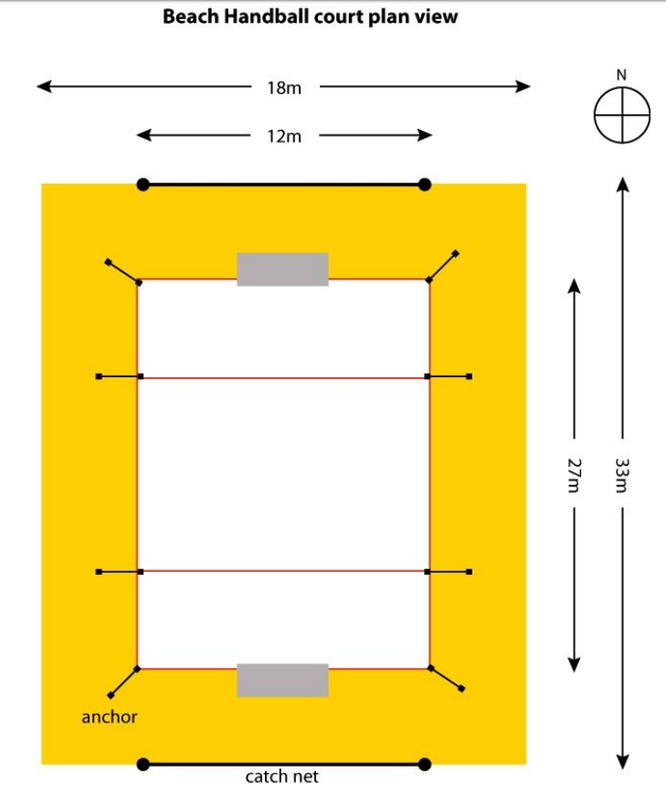
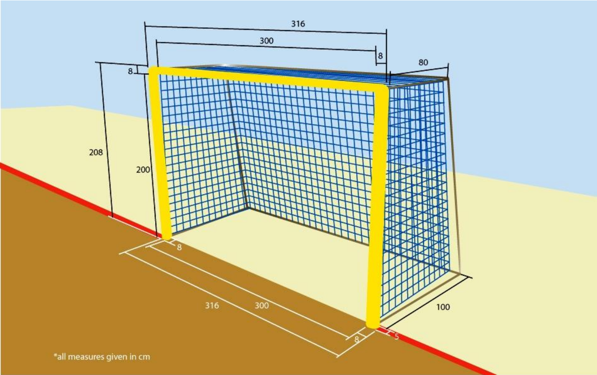

## El terreno de juego

### 1:1
El terreno de juego ([gráfico Núm. 1](#gráfico-núm.-1)) es un rectángulo de 27 metros de largo y 12 metros de ancho, que consta de un área de juego y dos áreas de portería. Las dimensiones del terreno de juego se miden desde el borde exterior de las líneas que delimitan el campo.

La superficie del terreno de juego debe componerse de arena nivelada, tan llana y uniforme como sea posible, libre de piedras, conchas y cualquier otra cosa que pueda representar riegos de cortes o lesiones para los jugadores.

La arena debe tener al menos 40 centímetros de profundidad y componerse de granos finos no compactados. 

El terreno de juego debe tener orientación norte-sur.

Las características del terreno de juego no deben ser alteradas durante el encuentro de tal forma que uno de los equipos obtenga ventaja.

Deberá existir una zona de seguridad de 3 metros de ancho alrededor del terreno de juego.

El tiempo atmosférico no debe suponer ningún peligro de lesión para los jugadores.

Para las competiciones disputadas por la noche, la iluminación en el área de juego debe ser de 400 lux (mínimo).

### 1:2
El terreno de juego está demarcado por líneas ([gráfico Núm. 1a](#gráfico-núm.-1a)). Cada línea pertenece a la zona que demarca. Las dos líneas más largas que delimitan el campo se denominan líneas laterales. Las dos líneas más cortas que delimitan el campo se llaman líneas de meta, aunque no hay una línea entre los postes de la portería. Las líneas que delimitan el área de portería se encuentran a seis metros de la línea de gol y discurren en paralelo a ésta.

El terreno de juego está dividido en dos mitades por una línea imaginaria en el medio. El centro de esta línea imaginaria es la posición exacta para el saque de árbitro.

### 1:3
Todas las líneas medirán entre cinco y ocho centímetros de ancho y estarán hechas de cinta de un color vivo que resalte en la arena (azul, amarillo o rojo). Las cintas deberán ser flexibles y resistentes al desgaste, pero no deberán dañar los pies de los jugadores ni de los oficiales, y estarán firmemente ancladas en la arena en cada esquina del terreno de juego y en la inserción entre cada línea de área de portería y la línea de banda, con todos los anclajes bien enterrados.

Cada esquina debe unirse a una cuerda elástica y se conectará a una madera enterrada o a un disco de anclaje de plástico (sin bordes afilados). La amortiguación de la cuerda proporcionará la tensión necesaria para mantener los límites de las líneas en su lugar del mismo modo que esa misma amortiguación reducirá las posibilidades de lesión en el caso de que el pie de un jugador o de un oficial quede capturado debajo de una línea. Las líneas de portería se fijarán a la portería a través de unos anillos de goma sujetos a los postes. Los anclajes no deben suponer un peligro para los jugadores y oficiales.

## La portería

### 1:4
* a) En el centro de cada línea de portería se colocará una portería rectangular. Deberá constar de dos postes verticales, equidistantes de las esquinas del campo y unidos en la parte superior por un travesaño horizontal o larguero.

* b) Los postes de la portería se extenderán verticalmente y la altura será de dos metros contados desde la superficie de la arena hasta la parte inferior del travesaño horizontal, y la distancia interna entre los postes verticales será de tres metros.

* c) Los postes y el larguero de la portería que forman la estructura de aluminio tubular deberán ser de un diseño específico, con un diámetro externo de ocho centímetros y pintados en un color vivo que contraste claramente con la arena y con el fondo (amarillo, azul o rojo). El color de ambas porterías debe ser el mismo.

* d) Los postes y el larguero de la portería deberá completarse con un bastidor de soporte de la red, cuyo punto más profundo será de 80 centímetros en la parte superior y de un metro en la parte inferior.

* e) Cada portería debe incluir una red, hecha de nylon de alta calidad (u otro material sintético similar, sin nudos, con cuadrados en la malla de 80 milimetros x 80 milimetros o de menor tamaño, con espesor del nylon de seis milímetros) unida a la parte posterior de los postes y al larguero. La red debe quedar sujeta de tal manera que un balón lanzado contra el lateral de la portería nunca pueda pasar entre la red y el poste y que pueda ser confundido con un gol, y que un balón lanzado a portería no pase entre los postes y la red de forma que se confunda con lanzamiento errado, buscando por tanto una sujeción adecuada y que no interfiera con el portero.
La parte inferior de la red debe estar sujeta a un tubo o a cualquier otro soporte adecuado, de tal forma que el balón que entra en la portería no puede superar en ningún caso la red. El color de la red deberá contrastar con la arena y el fondo y será del mismo color que la portería. 

* f) Por seguridad de los jugadores y oficiales, la parte inferior de cada portería tiene que estar anclada adecuadamente debajo de la arena. Los anclajes no deben crear un peligro para los jugadores.

* g) Tres metros por detrás de cada área de gol, debe colocarse una red de protección (detección) suspendida a lo largo de toda la longitud del campo de juego (12 metros x 7 metros de altura). Las redes de protección (detención) deben llegar adecuadamente a la arena.

## La mesa del cronometrador y anotador

### 1:5
La mesa del cronometrador y anotador tendrá espacio para 3-4 personas y estará situada en el centro de la línea de banda y al menos a 3 metros hacia el exterior de la misma.

La mesa del cronometrador y anotador tiene que situarse de tal forma que el cronometrador y el anotador puedan ver las zonas de cambio.

## Las zonas de cambio

### 1:6 
La zona de cambio para los jugadores de campo es de 15 metros de largo y aproximadamente 3 metros de ancho. Las zonas de cambio se sitúan a ambos lados del área de juego, hacia el exterior de las líneas de banda. Los jugadores de campo deben entrar al terreno de juego sólo desde esta zona.

### 1:7
* a) Se permite a los porteros y jugadores de campo que abandonen el área de juego por el camino más corto a la banda de la zona de cambio de su propio equipo. Esto en la práctica significa que los jugadores pueden abandonar el terreno de juego más allá de toda la línea de banda del área de juego y de las áreas de portería por el lado de la zona de cambio de su propio equipo.

* b) Los porteros tienen que entrar en el terreno de juego por la línea de banda de su propia área de portería por el lado de la zona de cambio de su propio equipo (reglas [4:13](#4:13), [5:12](#5:12)).

* c) Se permite al portero reserva esperar su turno de entrada al terreno de juego sentado (o arrodillado) en la parte de la línea de banda que discurre entre la línea de portería y la línea de área de portería de su equipo.

#### Gráfico Núm. 1
El terreno de juego

### Gráfico Núm. 1a
El terreno de juego

### Gráfico Núm. 2
La portería

