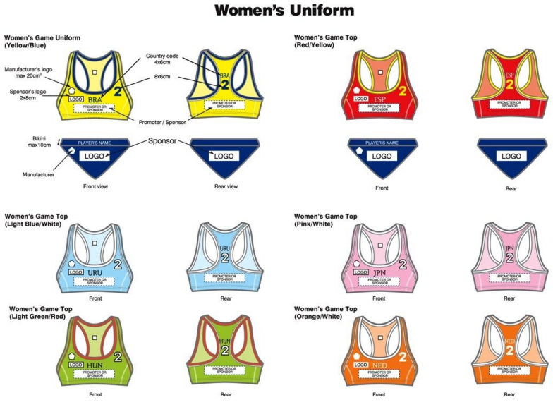

# Reglamento relativo al uniforme deportivo

Los uniformes y accesorios deportivos de los jugadores contribuirán a ayudar e incrementar su rendimiento, del mismo modo que aumentarán el espectáculo y el atractivo de este deporte.

Esta parte de las reglas proporciona todos los detalles referente a especificaciones de uniformes y accesorios en lo que respecta al color, estilo, cantidad y calidad de la tela que se espera que utilicen todos los deportistas y organizadores.

La Dirección de la Competición debe revisar los uniformes de los jugadores de cada equipo participante durante la reunión técnica y durante el evento. Todos los uniformes deportivos masculinos y femeninos deben responder a los criterios indicados a continuación. Conforme a la Carta Olímpica, están estrictamente prohibidos los mensajes religiosos, políticos o raciales en los uniformes deportivos.

### Modelo de camiseta masculina / top femenino
El modelo de las camisetas/tops debe estar en consonancia con los gráficos que se muestran. Las camisetas masculinas deben ser sin mangas y ajustadas, respetando el espacio requerido para las marcas o logotipos. Los tops femeninos (un diseño con el estómago al descubierto) deben ser también ajustados, con sisas ampliamente recortadas por la espalda, respetando siempre el espacio requerido para las marcas o logotipos. No se permite llevar camisetas de manga corta debajo de la camiseta sin mangas oficial del equipo.

#### Color
las camisetas sin mangas/tops serán de colores brillantes y claros (por ejemplo, rojo, azul, amarillo, verde, naranja o blanco) con el propósito de reflejar los colores que normalmente se usan y visten en la playa.

#### Marcas y logotipos
- logotipos de patrocinadores/sponsors:

   los logotipos de los patrocinadores/sponsors deben estar impresos en la parte frontal y trasera de las camisetas masculinas y en la parte frontal y trasera de los tops femeninos.
- Logotipo del fabricante

   el logotipo del fabricante estará impreso en la parte frontal de las camisetas/tops y no deben exceder de 20 cm2.

#### Número del jugador
El número del jugador, de aproximadamente 12 x 10 centímetros para las camisetas sin mangas masculinas y 8 x 6 centímetros para los tops femeninos, deberán situarse en las partes frontales y traseras de los mismos. Esta información debe imprimirse en un color que contraste con el de la camiseta sin manga/top (por ejemplo, claro sobre camiseta/top oscuro, oscuro sobre camiseta/top claro).

### Modelo de pantalón corto masculino / bikini inferior femenino 
Los miembros de un equipo deben vestir idénticos pantalones cortos/ bikinis inferiores. Los jugadores masculinos deben llevar pantalones cortos conforme al gráfico adjunto. Los pantalones cortos de los jugadores, siempre que no sean muy holgados, pueden ser más largos pero **deben de quedar 10 centímetros por encima de la rótula**. Las jugadoras deben llevar bikinis inferiores que estén en consonancia con el gráfico adjunto, con talla ajustada y corte en ángulo ascendente hacia la parte superior de la pierna. El lado ancho debe ser de un **máximo de 10 centímetros**.

Los equipos están autorizados a llevar logotipos de los sponsors (incluido el fabricante) en sus pantalones cortos/bikinis inferiores (o trajes de baño de una pieza), situados en cualquier posición y en cualquier tamaño.

No hay limitación en el número de los sponsors que se pueden mostrar en los pantalones cortos/bikinis inferiores. Los deportistas están obligados a imprimir su nombre, apodo en sus pantalones cortos/bikinis inferiores.

Los respectivos oficiales de equipo deben someter los uniformes de sus propios equipos (camisetas sin mangas/tops, pantalones cortos/ bikinis inferiores o trajes de baño de una pieza) a su aprobación durante la Reunión Técnica previa a la competición.

No están permitidas las camisetas de manga corta debajo de las camisetas sin mangas oficiales del equipo. 

Además, cualquier prenda térmica deben ser del mismo color que su respectiva parte del uniforme.

### Temperatura fría
En condiciones meteorológicas severas se permite que los jugadores utilicen uniformes compuestos de camiseta ajustada y pantalones largos ajustados (que lleguen a los tobillos y no a las rodillas). Estos deben seguir en diseño y color las mismas reglas de marketing que las dispuestas para los pantalones cortos y bikinis inferiores de los(as) jugadores(as), sin consideración a su tamaño y posición. La Dirección de la Competición será la última responsable de permitir que los jugadores vistan tal uniforme especial siempre que se requiera, después de consultar con el personal médico oficial.

El uniforme para tiempo frío estará compuesto de una camiseta ajustada de manga larga o corta y/o pantalones largos ajustados. Este uniforme debe quedar ajustado al cuerpo y coincidir en modelo, longitud y color para todos los jugadores del mismo equipo.

En lo que respecta a las camisetas/tops para tiempo frío, los logotipos del sponsor están permitidos en la ropa de frío tanto masculina como femenina. En lo que respecta a los pantalones para tiempo frío, los logotipos del sponsor están permitidos tanto en los hombres (llevando sus pantalones cortos encima) como las mujeres (sin llevar sus bikinis inferiores encima), de acuerdo con las reglas generales que arriba se establecen.

### Uniforme Masculino

### Uniforme Femenino

