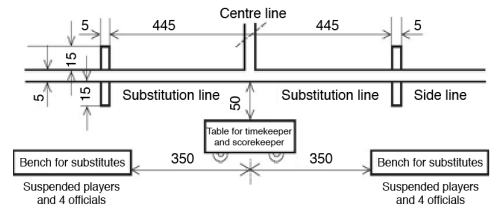

# Die Spielfläche

### 1:1 
Die Spielfläche ([Abb. 1](#diagram-1)) ist ein Rechteck von 40 m Länge und 20 m Breite und umfasst zwei Torräume 
(Regel [1:4](#1:4) und Regel [6](#6:1)) und ein Spielfeld. Die Längsseiten heißen Seitenlinien, die Breitseiten 
Torauslinien, zwischen den Torpfosten jedoch Torlinien. 

Eine Sicherheitszone entlang der Spielfläche von mindestens 1 m neben den Seitenlinien und 2 m hinter 
den Torauslinien sollte gegeben sein. 

Die Beschaffenheit der Spielfläche darf im Spielverlauf nicht zugunsten einer Mannschaft verändert werden.

### 1:2 
In der Mitte der beiden Torauslinien steht ein Tor ([Abbildung 2a](#diagram-2a) und [2b](#diagram-2b)). Die Tore 
müssen fest im Boden oder an den Wänden hinter ihnen verankert sein. Sie sind im Lichten 2 m hoch und 3 m breit. 

Die Pfosten des Tores sind durch eine Querlatte fest verbunden. Ihre hintere Kante muss mit der hinteren Seite 
der Torlinie verlaufen. Torpfosten und Latte müssen quadratisch sein (8 cm). Sie müssen auf den drei vom Spielfeld 
einzusehenden Seiten mit zwei kontrastierenden Farben gestrichen sein, die sich ebenfalls deutlich vom Hintergrund 
abheben sollen. 

Jedes Tor muss mit einem Netz versehen sein. Dieses muss so aufgehängt werden, dass ein in das Tor geworfener Ball 
normalerweise im Tor verbleibt.

### 1:3 
Alle Linien auf der Spielfläche sind integraler Bestandteil des Bereichs, den sie begrenzen. Die Torlinien zwischen 
den Torpfosten sind 8 cm breit ([Abb. 2a](#diagram-2a)), alle anderen Linien sind 5 cm breit. 

Zwei nebeneinander liegende Bereiche können anstatt durch Linien auch durch unterschiedliche Farben voneinander 
abgegrenzt werden.

### 1:4 
Vor jedem Tor befindet sich der Torraum ([Abb. 5](#diagram-5)). Der Torraum wird wie folgt von der Torraumlinie 
(6-m-Linie) begrenzt:

* a) Vor dem Tor wird in 6 m Abstand parallel zur Torlinie eine 3 m lange Linie gezogen (gemessen von der hinteren 
Kante der Torlinie zur vorderen Kante der Torraumlinie).

* b) Zwei Viertelkreise von 6 m Halbmesser (gemessen von der hinteren Innenkante der Torpfosten) verbinden die 3 m 
lange Linie mit der Torauslinie ([Abb. 1](#diagram-1) und [2a](#diagram-2a)).

### 1:5 
Die Freiwurflinie (9-m-Linie) wird gestrichelt und in 3 m Abstand vor der Torraumlinie gezogen. Die Markierungen der 
Freiwurflinie sowie die Zwischenräume messen 15 cm ([Abb. 1](#diagram-1)).

### 1:6 
Die 7-m-Linie ist eine 1-m-lange Linie vor dem Tor. Sie verläuft parallel zur Torlinie, gezogen in einem Abstand von 
7 m, gemessen von der hinteren Kante der Torlinie zur vorderen Kante der 7-m-Linie ([Abb. 1](#diagram-1)).

### 1:7 
Die Torwartgrenzlinie (4-m-Linie) ist eine 15 cm lange Linie vor dem Tor. Sie verläuft parallel zur Torlinie, gezogen 
in einem Abstand von 4 m, gemessen von der hinteren Kante der Torlinie zur vorderen Kante der 4-m-Linie 
([Abb. 1](#diagram-1)).

### 1:8 
Die Mittellinie verbindet die Halbierungspunkte der beiden Seitenlinien miteinander ([Abb. 1](#diagram-1) und 
[3](#diagram-3)).

### 1:9 
Die Auswechsellinie (ein Teil der Seitenlinie) reicht für jede Mannschaft von der Mittellinie bis zu einem 4,5 m von 
der Mittellinie entfernten Endpunkt. Von diesem Endpunkt der Auswechsellinien wird parallel zur Mittellinie und 
beiderseits der Seitenlinie eine 15 cm lange Linie gezogen ([Abb. 1](#diagram-1) und [3](#diagram-3)).

***Hinweis:***

*Detaillierte technische Anforderungen für die Spielfläche und die Tore enthalten die 
[Richtlinien für Spielflächen und Tore](#guidelines-for-playing-courts-and-goals).*

### Abbildung 1
Die Spielfläche 

Alle Maße sind in cm angegeben.

Torraum: Siehe auch [Abb. 5](#diagram-5)

### Abbildung 2a
Das Tor

### Abbildung 2b
Das Tor – Seitenansicht 

### Abbildung 3
Auswechsellinien und Auswechselraum

Der Tisch für Zeitnehmer/Sekretär und die Auswechselbänke müssen derart aufgestellt werden, dass die Auswechsellinien 
vom Zeitnehmer/ Sekretär zu sehen sind. Der Tisch sollte näher an der Seitenlinie stehen als die Bänke. Ein 
Mindestabstand von 50 cm zur Seitenlinie sollte vorhanden sein.
