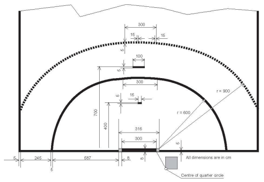

## Richtlinien für Spielfläche und Tore

- a) Die Spielfläche (Abb. 1) besteht aus einem Rechteck von 40 x 20 m. Sie sollte durch Messen der Länge der beiden 
  Diagonalen kontrolliert werden. Ihre Länge von Außenkante zu gegenüberliegender Außenkante sollte 44,72 m betragen. 
  Die Länge der Diagonalen einer Spielfeldhälfte sollte von den Außenkanten zur gegenüberliegenden Außenkante der 
  Schnittstelle zwischen der Mittellinie und der Seitenlinie 28,28 m betragen.

  Die Spielfläche ist mit Markierungen versehen, welche „Linien“ genannt werden. Die Torlinien (zwischen den Torpfosten) 
  sind, wie die Torpfosten, 8 cm, alle anderen Linien sind 5 cm breit. Linien, welche nebeneinanderliegende Bereiche der 
  Spielfläche begrenzen, können durch unterschiedliche Farben für die einzelnen Bereiche ersetzt werden.
- b) Der Torraum vor den Toren besteht aus einem Rechteck von 3 x 6 Meter und zwei sich anschließenden Viertelkreisen 
  mit einem Radius von je 6 Metern. Er wird erstellt, indem - parallel zur Torlinie und mit einem Abstand von 6 m 
  zwischen der hinteren Kante der Torlinie und der vorderen Kante der Torraumlinie - eine 3 m lange Linie gezogen wird. 
  Diese Linie geht auf beiden Seiten in einen Viertelkreis über, wobei die hinteren Innenkanten der betreffenden 
  Torpfosten jeweils die Mitte bilden und der Radius 6 m beträgt. Die Linien und Kreise, welche den Torraum begrenzen, 
  heißen Torraumlinie. Die Entfernung zwischen den Außenkanten der Schnittpunkte, an denen die beiden Kreise die 
  Torauslinie berühren, beträgt derart 15 m (Abb.5).
- c) Die gestrichelte Freiwurflinie (9-m-Linie) verläuft parallel und konzentrisch zur Torraumlinie, mit einem Abstand 
  von zusätzlich 3 m zur Torraumlinie. Die Markierungen und Zwischenräume messen jeweils 15 cm. Die Markierungen sollten 
  rechtwinklig bzw. radial abgeschnitten werden. Die Messung der kurvigen Markierungen erfolgt über die Sehne der 
  Markierungen (Abb. 5).
- d) Die 7-m-Linie ist 1 m lang und wird - parallel zur Torlinie - direkt vor dem Tor gezogen, wobei der Abstand von der 
  hinteren Kante der Torlinie zur vorderen Kante der 7-m-Linie 7 m beträgt (Abb. 5).
- e) Die Torwartgrenzlinie (4-m-Linie) vor dem Tor ist 15 cm lang. Sie verläuft - mit einem Abstand von 4 m, gemessen 
  von der hinteren Kante der Torlinie zur vorderen Kante der 4-m-Linie, also einschließlich beider Linien selbst - 
  parallel zur Torlinie.
- f) Die Spielfläche sollte von einer Sicherheitszone von mindestens 1 m entlang der Seitenlinien und 2 m hinter den 
  Torauslinien umgeben sein.
- g) Das Tor (Abb. 2) steht in der Mitte der betreffenden Torauslinien. Die Tore müssen fest im Boden oder an der hinter 
  ihnen befindlichen Wand verankert sein. Ihre lichte Breite beträgt 3 m und die lichte Höhe 2 m. Der Torrahmen muss ein 
  Rechteck sein, wobei die inneren Diagonalen 360,5 cm (höchstens 361 cm - mindestens 360 cm, mit einem Unterschied von 
  höchstens 0,5 cm in einem Tor) messen. Die hintere Seite der Torpfosten muss mit der hinteren Seite der Torlinie (und 
  der Torauslinie) eine Linie bilden, so dass die vordere Seite der Torpfosten 3 cm über die Torauslinie hinausreicht.
 
  Die Torpfosten und die Querlatte, welche sie verbindet, müssen aus dem gleichen Material bestehen (z.B. Holz, 
  Leichtmetall oder synthetisches Material) und quadratisch sein (8 cm). Die Kanten müssen abgerundet sein und einen 
  Radius von 4±1 mm aufweisen. Die Torpfosten und die Querlatte müssen auf den drei von der Spielfläche einzusehenden 
  Seiten mit zwei deutlich kontrastierenden Farben gestrichen sein, die sich ebenfalls deutlich vom Hintergrund abheben. 
  Die beiden Tore einer Spielfläche müssen dieselben Farben aufweisen.

  In der Ecke zwischen Pfosten und Querlatte messen die Farbstreifen der Tore 28 cm in jede Richtung und weisen dieselbe 
  Farbe auf. Alle anderen Streifen müssen 20 cm lang sein. Jedes Tor muss ein Netz, das sogenannte Tornetz, haben. 
  Dieses muss derart befestigt sein, dass ein in das Tor geworfener Ball normalerweise im Tor verbleibt oder nicht durch 
  das Tor hindurch fliegen kann. Falls notwendig kann - im Tor hinter der Torlinie - ein weiteres Netz angebracht 
  werden. Die Entfernung zwischen der Torlinie und diesem weiteren Netz sollte ca. 70 cm, aber mindestens jedoch 60 cm 
  betragen.
- h) Die Tiefe des Tornetzes sollte oben 0,9 m hinter der Torlinie und unten 1,1 m betragen, wobei für beide Maße eine 
  Toleranz von ± 0,1 m gilt. Die Maschen sollten nicht größer als 10 x 10 cm sein. Das Netz muss an den Pfosten und an 
  der Querlatte mindestens alle 20 cm befestigt sein. Es ist erlaubt, das Tornetz und das weitere Netz derart 
  zusammenzubinden, dass kein Ball zwischen die beiden Netze gelangen kann.
- i) Hinter dem Tor, in der Mitte der Torauslinie und mit einer Entfernung von ca. 1,5 m, sollte ein (vom Boden aus) 5 m 
  hohes, vertikales Sicherheitsnetz von 9-14 m Länge angebracht sein.
- j) Der Zeitnehmertisch steht in der Mitte des Auswechselraums an einer der beiden Seitenlinien. Der Tisch darf 
  höchstens 4 m lang sein und sollte 30-40 cm hoch über der Spielfläche stehen, um die uneingeschränkte Sicht 
  sicherzustellen.
- k) Alle Messungen ohne Angabe einer Toleranz müssen der ISO-Norm (International Standard Organization) 2768- 1: 1989 
  entsprechen.
- l) Die Normen für Handballtore sind vom Europäischen Komitee für Normung, CEN (Comité Européen de Normalisation), im 
  Rahmen der Norm EN 749 in Verbindung mit der Norm EN 202.10-1 festgelegt worden.

### Abbildung 5
Der Torraum mit Umgebungen

