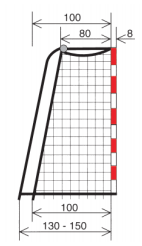

# Playing Court

### 1:1
The playing court (see [diagram 1](#diagram-1)) is a 40 metres long and 20 metres wide rectangle,
consisting of two goal areas (see [1:4](#1:4) and [6](#6:1) and a playing area. The longer boundary
lines are called side lines, and the shorter ones are called goal lines (between the
goalposts) or outer goal lines (on either side of the goal).

There should be a safety zone surrounding the playing court, with a width of at least 1
metre along the side lines and 2 metres behind the goal lines.

The characteristics of the playing court must not be altered during the game in such a
way that one team gains an advantage.

### 1:2
A goal (see [diagrams 2a](#diagram-2b) and [2b](#diagram-2b)) is placed in the centre of each outer goal line. The
goals must be firmly attached to the floor or to the walls behind them. They have an
interior height of 2 metres and a width of 3 metres.

The goalposts are joined by a horizontal crossbar. The rear side of the goalposts shall be
in line with the rear edge of the goal line. The goalposts and the crossbar must have an
8cm square cross section. On the three sides which are visible from the court they must
be painted in bands of two contrasting colours, which also contrast clearly with the
background.

The goals must have a net, that should be attached in such a way that a ball thrown into
the goal normally remains in the goal.

### 1:3
All lines on the court are fully part of the area that they enclose. The goal lines shall be
8cm wide between the goalposts (see [diagram 2a](#diagram-2a)), whereas all other lines shall be 5cm
wide.

Lines between two adjacent areas may be replaced with a difference in colours between
the adjacent areas of the floor.

### 1:4
In front of each goal there is a goal area (see [diagram 5](#diagram-5)). The goal area is
defined by the goal-area line (6-metre line), which is drawn as follows:

* a) a 3 metres long line directly in front of the goal; this line is parallel to the goal line and
6 metres away from it (measured from the rear edge of the goal line to the front edge
of the goal-area line);

* b) two quarter circles, each with a radius of 6 metres (measured from the rear inner
corner of the goalposts), connecting the 3 metres long line with the outer goal line (see
[diagrams 1](#diagram-1) and [2a](#diagram-2a)).

### 1:5
The free throw line (9-metre line) is a broken line, drawn 3 metres outside the goal-area
line. Both the segments of the line and the spaces between them measure 15cm (see [diagram 1](#diagram-1)).

### 1:6 
The 7-metre line is a 1 metre long line, directly in front of the goal. It is parallel to the
goal line and 7 metres away from it (measured from the rear edge of the goal line to the
front edge of the 7-metre line); (see [diagram 1](#diagram-1)).

### 1:7
The goalkeeper’s restraining line (the 4-metre line) is a 15cm long line, directly in front
of the goal. It is parallel to the goal line and 4 metres away from it (measured from the
rear edge of the goal line to the front edge of the 4-metre line) (see [diagram 1](#diagram-1)).

### 1:8
The centre line connects the midpoints of the two side lines (see [diagrams 1](#diagram-1) and [3](#diagram-3)).

### 1:9
The substitution line (a segment of the side line) for each team extends from the centre
line to a point at a distance of 4.5 metres from the centre line. This end point of the
substitution line is enhanced by a line which is parallel to the centre line, extending
15cm inside the sideline and 15cm outside the sideline (see [diagrams 1](#diagram-1) and [3](#diagram-3)).

***Note:***

*More detailed technical requirements for the playing court and the goals can be found in the
[Guidelines for Playing Courts and Goals](#guidelines-for-playing-courts-and-goals).*

### Diagram 1
The Playing Court

Dimensions indicated in cm.

Goal area: see also [diagram 5](#diagram-5)

### Diagram 2a
The Goal

### Diagram 2b
The Goal - lateral view

### Diagram 3
Substitution lines and substitution area

The table for timekeeper and scorekeeper and the benches for substitutes have to be placed in
such a way that the scorekeeper/timekeeper can see the substitution lines. The table should be
placed closer to the side line than the benches, but at least 50cm outside the side line.
